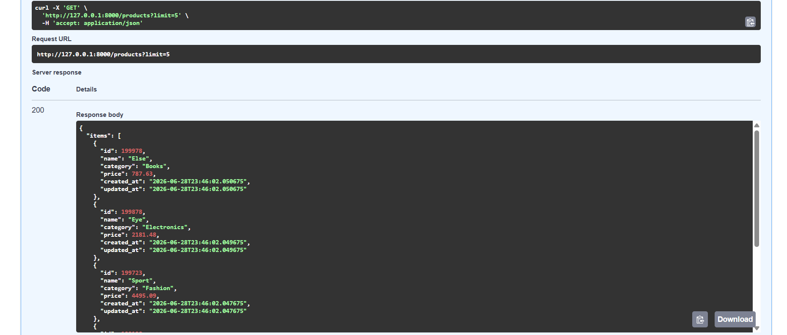

# Products API

| Parameter   | Type    | Description                                |
| ----------- | ------- | ------------------------------------------ |
| limit       | integer | Number of products to return (default: 20) |
| category    | string  | Filter by category                         |
| page_cursor | string  | Cursor returned from the previous response |

Tech Stack

- FastAPI
- PostgreSQL
- Docker
- Psycopg

Features

- Seed 200,000 fake products
- Cursor pagination
- Category filtering
- Docker support

Swagger documentation

